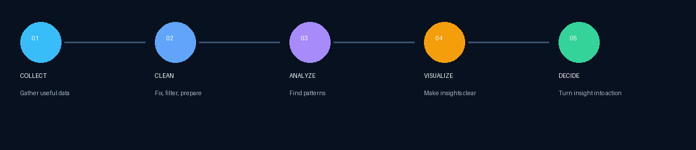

 

# Data Analyst

### Turning raw data into clear insights and better decisions.

  
  &nbsp;&nbsp;
  
  &nbsp;&nbsp;
  
  &nbsp;&nbsp;
  

---

## 👋 About Me

I’m building my career around **data analysis, visualization, and practical problem solving**.

I enjoy working with messy information, asking useful questions, discovering patterns, and communicating results in a way that is easy to understand.

My approach is simple:

> **Understand the question → work with the data → find the signal → communicate the insight.**

---

## 🧰 Skills & Tools

   
  <b>Python</b>

   
  <b>SQL</b>

   
  <b>Excel</b>

   
  <b>Power BI</b>

   
  <b>Pandas</b>

   
  <b>NumPy</b>

   
  <b>Matplotlib</b>

   
  <b>Seaborn</b>

   
  <b>Jupyter</b>

   
  <b>Git</b>

   
  <b>GitHub</b>

   
  <b>VS Code</b>

   
  <b>AWS</b>

---

## 📊 My Analytics Workflow

**Collect → Clean → Analyze → Visualize → Decide**

---

## 🔎 What I Focus On

- Data cleaning and preparation
- Exploratory data analysis
- SQL-based analysis
- Spreadsheet analysis
- Dashboard and visualization design
- Finding trends, patterns, and anomalies
- Turning analysis into understandable insights

---

## 📚 Continuous Learning

I’m continuously improving my ability to combine **technical analysis + business thinking**.

Current areas of focus:

- Advanced SQL
- Data visualization
- Statistics for analytics
- Business-oriented analysis
- Clear data storytelling

---

## 🎯 Professional Goal

> Build reliable analysis that helps people make **clearer, faster, and more informed decisions**.

I value curiosity, consistency, clean work, and the habit of asking **“why?”** before jumping to conclusions.

---

### Thanks for visiting.

**Data → Insight → Action**

 

